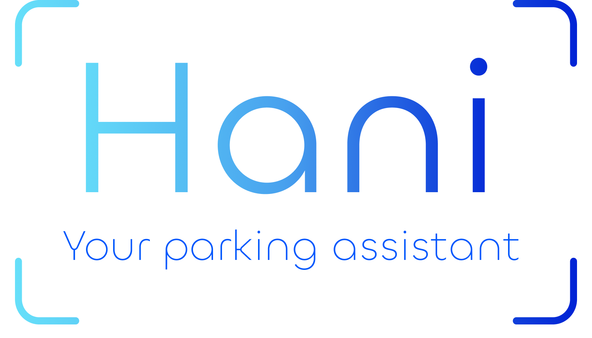

# 💡 Parking Space Detection
Use this template to describe and document your engineering project.

<!-- cool project cover image -->


<!-- table of content -->
## Table of Contents
- [The Team](#the-team)
- [Project Description](#project-description)
- [Getting Started](#getting-started)
- [Prerequisites](#prerequisites)
- [Installing](#installing)
- [Testing](#testing)
- [Deployment](#deployment)
- [Built With](#built-with)
- [Acknowledgments](#acknowledgments)

## 👥 The Team 
**Team Members**
- [Shira Adler](shira.adler@mail.huji.ac.il)
- [Elli Sackstein](elli.sackstein@mail.huji.ac.il)

**Supervisor**
- [Matan Levy](levy@cs.huji.ac.il)


## 📚 Project Description
Our project aims to develop an advanced application for detecting available
parking spots using live street video feeds, using pre-installed cameras.
 The application utilizes YOLO for car detection within the camera frames and
employs our proprietary algorithms to identify and extract vacant parking spots.

The output includes a photo of the street with clearly marked free parking 
spaces. Additionally, users receive a map with the location of available spots
marked, and they can utilize integrated Google Maps API features to obtain 
directions to these spots.

## ⚡ Getting Started

These instructions will give you a copy of the project up and running on
your local machine for development and testing purposes. 

### 🧱 Prerequisites

Install requirements from requirements.txt:

   ```bash
    pip install -r requirements.txt
   ```

### 🏗️ Installing
A step by step series of examples that tell you how to get a development environment running

Say what the step will be

    Give the example

And repeat

    until finished

End with an example of getting some data out of the system or using it
for a little demo

## 🧪 Testing
We tested our two approaches : Configured and Non-configured.

#### **Free parking spots detection:** 
In these tests, we marked the free parking spots and compared those markings 
to the output of our algorithm, which is a list of bounding boxes identifying
the free parking spots detected in the image. These tests were executed on both
Configured and Non-configured approaches.

#### **Moving cars detection:**
In addition to the tests above, we evaluated our ability to detect moving cars
in a set of images. 
Similar to the previous tests, we marked the moving cars in each picture 
and compared these markings to the output of our moving cars detection
algorithm, which is a bounding box identifying the moving car in the image.
These tests were executed only on the Non-configured approach.

### Sample Tests
Run the [Free parking spots](Tests/FreeParkingSpotsTests.py) tests

    Python FreeParkingSpotsTests.py

You will get the results:

    !!!!!!!!!!!! ADD !!!!!!!!!!!!


## 🚀 Deployment
Add additional notes on how to deploy this on a live system

## ⚙️ Built With
  - [Based on the amazing work of reserch group xxxx](https://www.example.com)
  - [Contributor Covenant](https://www.contributor-covenant.org/) - Used for the Code of Conduct
  - [Creative Commons](https://creativecommons.org/) - Used to choose the license


## 🙏 Acknowledgments
  - [Yolov9 repository](https://github.com/WongKinYiu/yolov9/tree/main?tab=readme-ov-file#evaluation)
  - Inspiration
  - etc