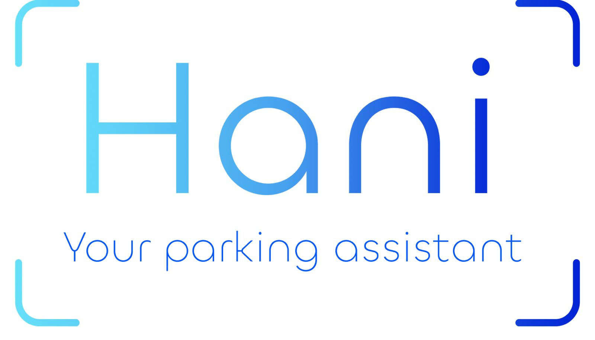
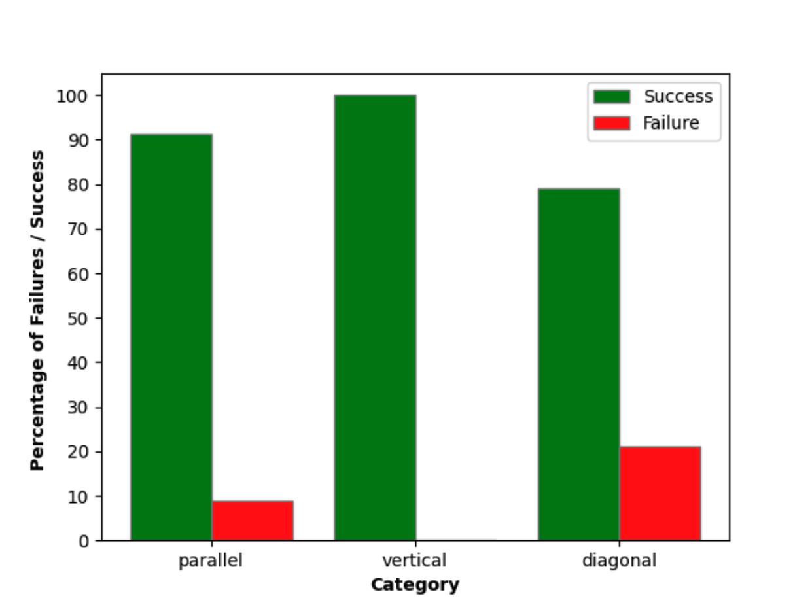
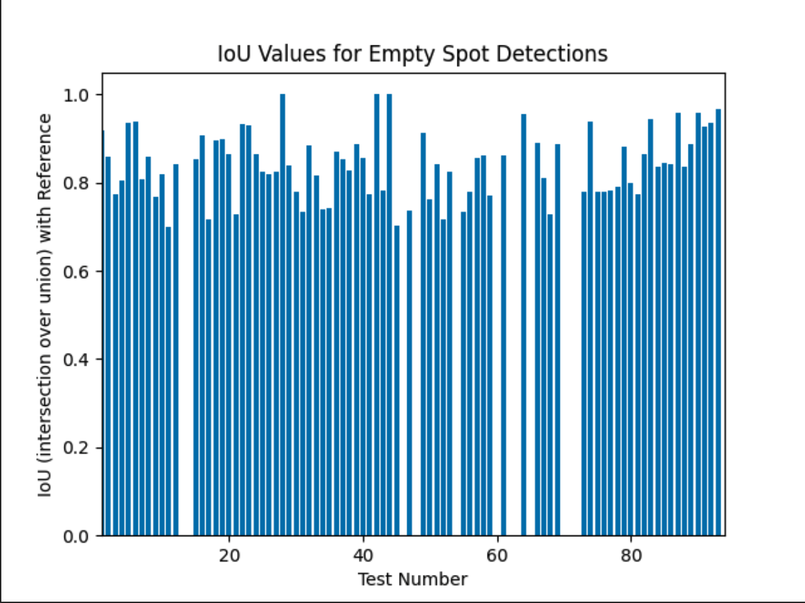

# 💡 Parking Space Detection
Use this template to describe and document your engineering project.

<!-- cool project cover image -->



<!-- table of content -->
## Table of Contents
- [The Team](#the-team)
- [Project Description](#project-description)
- [Getting Started](#getting-started)
- [Prerequisites](#prerequisites)
- [Installing](#installing)
- [Testing](#testing)
- [Deployment](#deployment)
- [Built With](#built-with)
- [Acknowledgments](#acknowledgments)

## 👥 The Team 
**Team Members**
- [Shira Adler](shira.adler@mail.huji.ac.il)
- [Elli Sackstein](elli.sackstein@mail.huji.ac.il)

**Supervisor**
- [Matan Levy](levy@cs.huji.ac.il)


## 📚 Project Description
Our project aims to develop an advanced application for detecting available
parking spots using live street video feeds, using pre-installed cameras.
 The application utilizes YOLO for car detection within the camera frames and
employs our proprietary algorithms to identify and extract vacant parking spots.

The output includes a photo of the street with clearly marked free parking 
spaces. Additionally, users receive a map with the location of available spots
marked, and they can utilize integrated Google Maps API features to obtain 
directions to these spots.

## ⚡ Getting Started

These instructions will give you a copy of the project up and running on
your local machine for development and testing purposes. 

### 🧱 Prerequisites

Install requirements from requirements.txt:

   ```bash
    pip install -r requirements.txt
   ```

### 🕹️ Usage
To execute the code, obtain the stream URL and resolution URL for the configured ESP32 camera. Once acquired, insert the URLs in the appropriate sections within the `main.py` file.


Example of URL configuration:

    stream_url = "http://93.172.14.170:91/stream"
    resolution_url = "http://93.172.14.170:90/control?var=framesize&val=13"

  

## 🧪 Testing
We tested our two approaches : Configured and Non-configured.

#### **Configured - Free parking spots detection:** 
In these tests, we marked the free parking spots and compared those markings 
to the output of our algorithm, which is a list of bounding boxes identifying
the free parking spots detected in the image. These tests were executed on both
Configured and Non-configured approaches.

#### **Non-configured - Moving cars detection:**
In addition to the tests above, we evaluated our ability to detect moving cars
in a set of images. 
Similar to the previous tests, we marked the moving cars in each picture 
and compared these markings to the output of our moving cars detection
algorithm, which is a bounding box identifying the moving car in the image.
These tests were executed only on the Non-configured approach.

### Sample Tests
For the Free parking spots detection tests, Run the [Free parking spots](Tests/FreeParkingSpotsTestsCon.py) tests

```bash
    Python FreeParkingSpotsTests.py
```

In the results, you will find two key tables:

- Algorithm’s Success and Failure: These graphs depict the algorithm's accuracy in detecting empty spots, counting each correctly or incorrectly detected spot. The results are presented in both percentage and absolute numbers.


- IOU Rate: This graph shows the Intersection Over Union (IOU) rate, comparing the algorithm's output boxes to the reference boxes from the test set.




## 🚀 Deployment

### Live Data with ESP32 Camera Module
In order to get live data, use the ESP32 camera module, just as we did.

#### Steps to Follow
1. **Upload Code to the Camera**
   - First, you'll need to upload the following code to the camera using one of the many IDEs that work with ESP controllers (e.g., Arduino IDE). 
2. **Set Up the Camera**
   - Follow this [tutorial](https://www.youtube.com/watch?v=RCtVxZnjPmY) to ensure you can access the camera's URL and capture a live photo from your parking zone.
3. **Extract Stream and Resolution URLs**
   - Navigate to the camera's live stream webpage.
   - Open the browser's Developer Tools (usually F12 or Ctrl+Shift+I).
   - In the Network tab, filter for media or XHR requests.
   - Identify and copy the following URLs:
     - Stream URL: Typically an HLS (.m3u8) or RTMP stream link
     - Resolution URL: Often a JSON endpoint for available stream qualities
   - Insert the extracted URLs into the appropriate variables or constants in `main.py`.
4. **Position the Camera**
   - Place the camera, so it is positioned vertically to the street.
5. **Execute the Script**
   - Run the main script from the command line:
     ```bash
     python main.py
     ```


## ⚙️ Built With
  - [Yolov9 repository](https://github.com/WongKinYiu/yolov9/tree/main?tab=readme-ov-file#evaluation) - Used for detecting cars
  - [ESP32 cam tutorial](https://www.youtube.com/watch?v=RCtVxZnjPmY) - Used to utilize ESP32 camera


## 🙏 Acknowledgments
  - [Yolov9 repository](https://github.com/WongKinYiu/yolov9/tree/main?tab=readme-ov-file#evaluation)
  - [Machine Learning based Vacant Space Detection for Smart Parking Solutions](https://ieeexplore.ieee.org/document/10165557)
